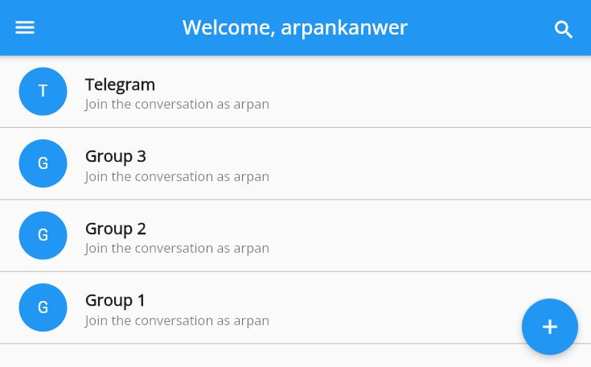

# Group Chat Application

A real-time group chat application that allows users to send messages using Firebase Storage. Users can create groups, join existing groups by searching for their names, and administrators can manage group members. The application provides a seamless chatting experience similar to popular messaging platforms like Telegram.

## Usage

To use the application, you can visit the following link: [Chatie](https://chatie1.web.app/)

## Features

- User authentication: Users can create accounts and log in to access the application.
- Group creation: Users can create their own groups and become administrators.
- Group search: Users can search for groups by their names and join them.
- Real-time messaging: Users can send and receive messages in real-time.
- File attachments: Users can send images, videos, and other files as attachments.
- Admin features: Group administrators can manage group members and permissions.

## Technologies Used

- Firebase Authentication: For user authentication and account management.
- Firebase Firestore: For real-time messaging and storing chat data.
- Firebase Storage: For storing and retrieving file attachments.
- Flutter: The framework used for developing the mobile application.
- Dart: The programming language used for building the application logic.

## License

This project is licensed under the [MIT License](LICENSE).

## Contact

For any inquiries or feedback, please contact [Arpan Kanwer](mailto:kanwer@sheridancollege.ca).